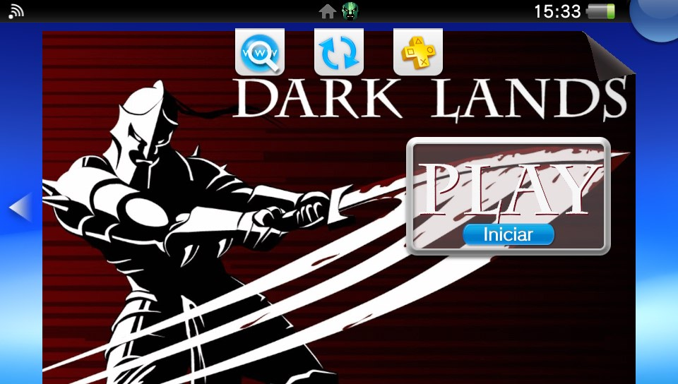
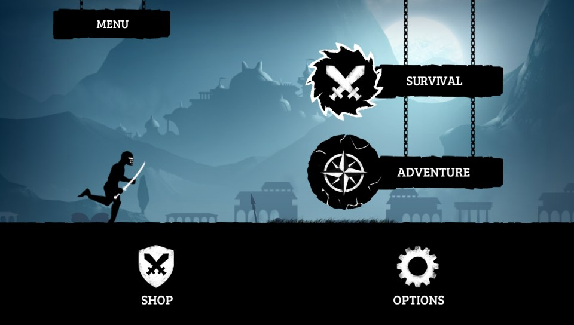
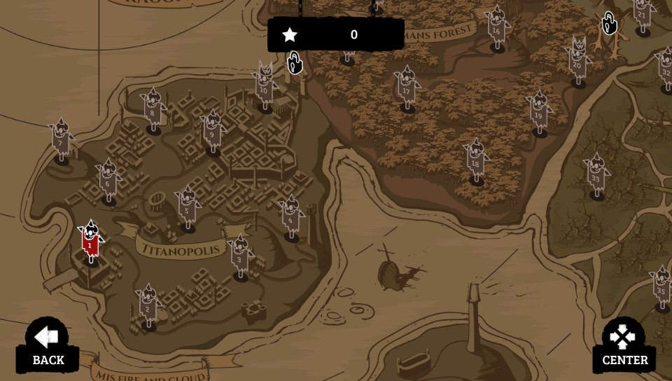
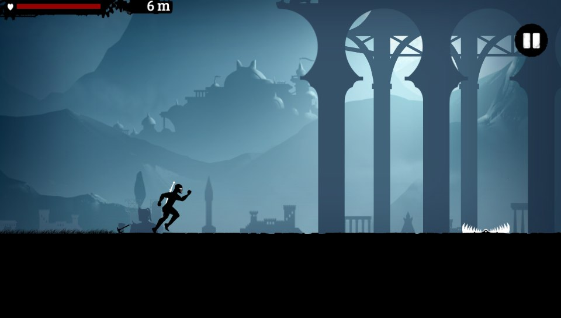
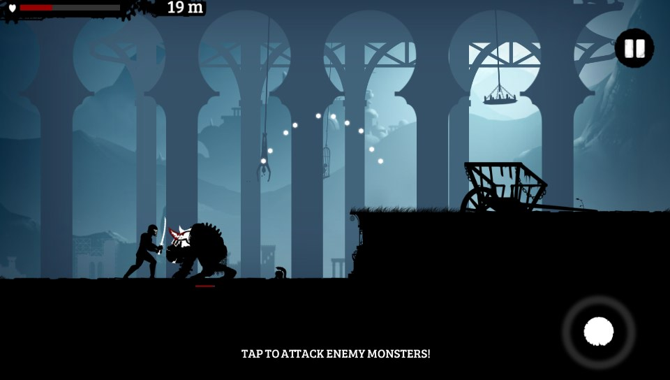
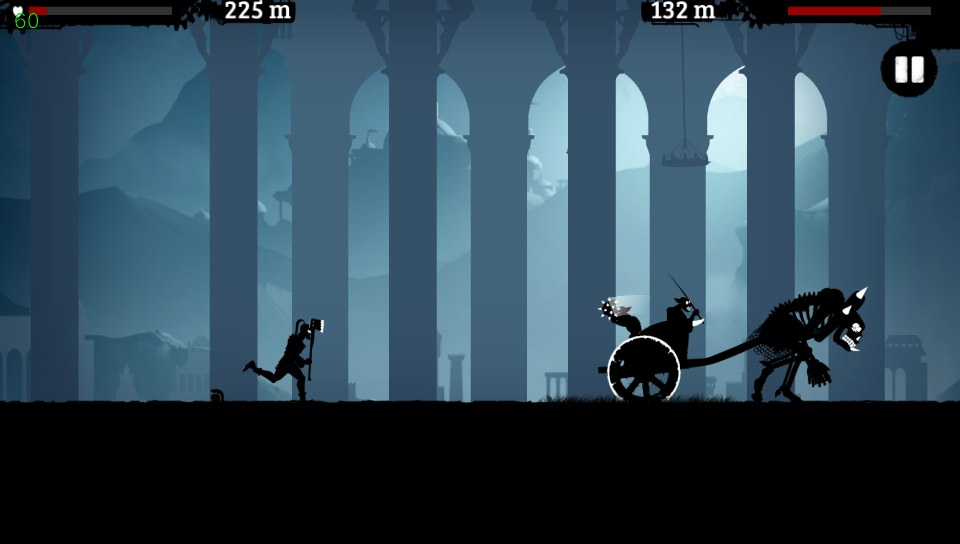

# Dark Lands - PS Vita Port

**Dark Lands** is a 2D action-platformer in which players take on the role of an Ancient Greek hero. With nothing but their reflexes and a faithful sword, they must survive a dark world filled with shadows, deadly obstacles, and relentless foes.

> [!WARNING]
> This port was developed with the assistance of LLMs for reverse engineering closed-source applications and implementing parts of the codebase. AI was primarily used to assist with loader crash analysis and certain code implementations. The final result has been manually reviewed and refined; however, as with any complex software project, some unexpected issues or edge cases may still be present.

This is a wrapper/port of **Dark Lands** for the *PS Vita*.
 
The port works by loading the official Android ARMv7 executable in memory, resolving its imports with native functions and patching it in order to properly run. You must provide your own legally obtained Android APK. Do not redistribute proprietary game code, executables, assets, or APK files unless you have the rights to do so.

## Changelog

### v1.0

- Initial release.
- Vita loader for the Android `libcocos2dcpp.so`.
- Vita controls mapped through the game's existing touch/key input path.
- Native Vita audio bridge with MP3-to-OGG asset redirection.


## Official Game Download

- [Amazon](https://www.amazon.com/Bulkypix-DarkLands/dp/B00L1DZTDS)

## Setup Instructions For End Users

1. Install [kubridge](https://github.com/TheOfficialFloW/kubridge/releases/) and [FdFix](https://github.com/TheOfficialFloW/FdFix/releases/) by copying `kubridge.skprx` and `fd_fix.skprx` to your taiHEN plugins folder.

   The folder is commonly `ur0:tai`, but use `ux0:tai` if that is how your Vita is configured. Add both plugins under `*KERNEL` in `config.txt`:

   ```text
   *KERNEL
   ur0:tai/kubridge.skprx
   ur0:tai/fd_fix.skprx
   ```

   Do not install `fd_fix.skprx` if you are already using the rePatch plugin.

2. Install `libshacccg.suprx` to `ur0:/data/` or `ur0:/data/external/`. If you do not have it, follow a [libshacccg extraction guide](https://samilops2.gitbook.io/vita-troubleshooting-guide/shader-compiler/extract-libshacccg.suprx).

3. The game runs correctly at the default 444 MHz CPU clock. For the best performance, however, it's recommended to install [PSVshell](https://github.com/Electry/PSVshell/releases) and overclock the Vita to 500 MHz.

4. Install `dla.vpk`.

5. Create this folder on the Vita:

   ```text
   ux0:data/dla/
   ```

6. From your legally obtained Android APK, extract:
   - Obtain `dark-lands-1-5-6.apk` (version **1.5.6**).
   - Verify that the APK matches the expected SHA-256 checksum:

     **Windows (Command Prompt):**
      ```cmd
      certutil -hashfile dark-lands-1-5-6.apk SHA256
      ```
   
      Expected output:
   
      ```text
      7ecd7f1c4cd2e9d9066b0515c7bde2af7ce6d0a8b7d79deab652b98e7f3d1b0e
      ```

   - `lib/armeabi-v7a/libcocos2dcpp.so` to `ux0:data/dla/libcocos2dcpp.so`
   - the APK's `assets` folder to `ux0:data/dla/assets`
   - the APK itself to `ux0:data/dla/base.apk`

   The clean final layout should look like this:

   ```text
   ux0:data/dla/
   |- base.apk
   |- libcocos2dcpp.so
   |- assets/
   |  |- ...
   |- gxp/                       created by the port when shader cache is used
   |- DarkLandsSecurePrefs.bin   created by the port after saving
   |- SharedPreferences.bin      created by the port after saving
   ```

## Audio Assets

The Android game requests MP3 files they need tyo be converted to .ogg files,

Convert the APK's MP3 files on a PC with Python 3 and `ffmpeg` installed:

```bash
python extras/scripts/convert_apk_audio.py base.apk converted_audio
```

Then copy or merge `converted_audio/assets` into:

```text
ux0:data/dla/assets
```

Keep the paths under `assets` unchanged.

## Controls

| Vita input | Action |
| --- | --- |
| D-Pad Up | Swipe up / jump |
| D-Pad Down | Swipe down / slide |
| Circle/Cross | Attack |
| R and L | Block |
| Touchscreen | Native game touch input |

## Build Instructions For Developers

You need a [VitaSDK](https://github.com/vitasdk) environment built for the soft-float ABI. All native dependencies must also be built with `-mfloat-abi=softfp`; do not mix hard-float and soft-float libraries.

The project expects `VITASDK` to be set, or `CMAKE_TOOLCHAIN_FILE` to point at `vita.toolchain.cmake`.

PowerShell example:

```powershell
$env:VITASDK="C:\vitasdk"
$env:Path="$env:VITASDK\bin;$env:Path"
```

Linux/WSL example:

```bash
export VITASDK=/usr/local/vitasdk
export PATH="$VITASDK/bin:$PATH"
```

Install the Vita-side libraries used by `CMakeLists.txt`, built for softfp:

- [vitaGL](https://github.com/Rinnegatamante/vitaGL)
- [vitaShaRK](https://github.com/Rinnegatamante/vitaShaRK)
- [libmathneon](https://github.com/Rinnegatamante/math-neon)
- [kubridge](https://github.com/TheOfficialFloW/kubridge)
- SoLoud, libsndfile, OGG/Vorbis, FLAC, OpenSLES stubs, and the VitaSDK system stubs linked by the project

Recommended vitaGL build flags:

```bash
make NO_DEBUG=1 SOFTFP_ABI=1 HAVE_GLSL_SUPPORT=1 HAVE_SHADER_CACHE=1 USE_SCRATCH_MEMORY=1 CIRCULAR_VERTEX_POOL=2 install -j$(nproc)
```

Build a release VPK:

```bash
cmake -S . -B build -DCMAKE_BUILD_TYPE=Release -DDEBUG=0 -DSHADER_FORMAT=GLSL -DUSE_SCELIBC_IO=ON -DENABLE_MSAA_4X=OFF -DDUMP_COMPILED_SHADERS=ON
cmake --build build
```

Build with verbose loader/runtime logs:

```bash
cmake -S . -B build-debug -DCMAKE_BUILD_TYPE=Debug -DDEBUG=1 -DSHADER_FORMAT=GLSL -DUSE_SCELIBC_IO=ON
cmake --build build-debug
```

The build produces `build/dla.vpk` and also updates the root `dla.vpk`.

---
## Screenshots

 
 
 
  



---
## Credits

- TheFloW for the original Android `.so` loader work.
- Rinnegatamante for vitaGL and help with Vita ports.
- gl33ntwine/v-atamanenko for SoLoBoP and Android loader boilerplate work.
- The Vita Nuova community and everyone who helped with testing/debugging.

## License

This software may be modified and distributed under the terms of the MIT license. See [LICENSE](LICENSE) for details.
